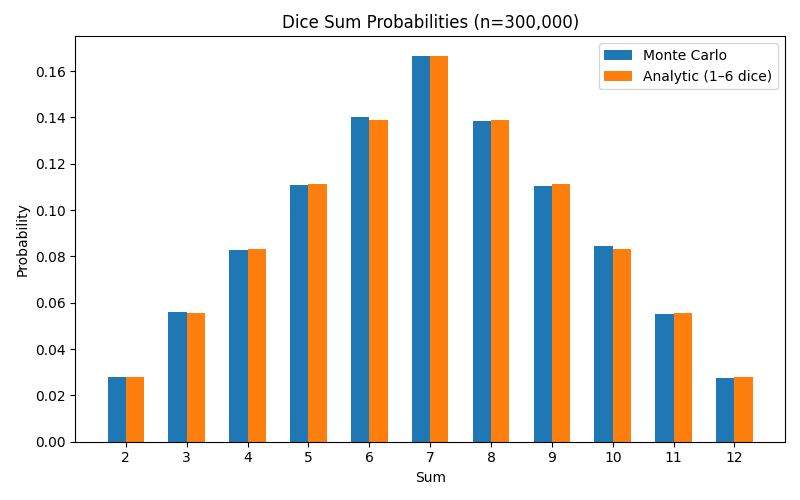
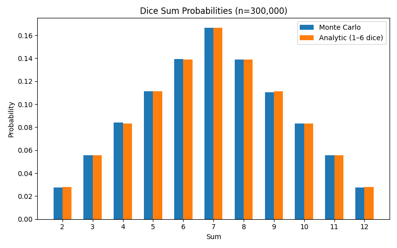

# GOIT Data Structures Final project

```bash
pip install -r requirements.txt
```

## Tasks
- `task-01.py`: singly linked list reverse, insertion sort, merge two sorted lists.
```bash
python task-01.py
```

Initial: [7, 3, 9, 1, 5]
Reversed: [5, 1, 9, 3, 7]
Sorted (insertion): [1, 3, 5, 7, 9]
Merged sorted lists: [1, 2, 3, 4, 5, 6, 7, 8, 10]
Conclusion: reverse changes links in-place; insertion_sort orders the list; merge_sorted combines two sorted lists preserving order.

- `task-02.py`: Pythagoras tree fractal using recursion with `--depth` argument.
```bash
python task-02.py --depth 9
```


- `task-03.py`: Dijkstra's shortest paths with a binary heap.
```bash
python task-03.py
```

Distances: {'A': 0, 'B': 4, 'C': 2, 'D': 9, 'E': 5, 'F': 20}
Parents: {'B': 'A', 'C': 'A', 'E': 'C', 'D': 'E', 'F': 'D'}
Conclusion: using a binary heap keeps selection of the next closest vertex efficient (O((V+E) log V)).
- `task-04.py`: visualize a binary heap as a tree using NetworkX.
```bash
python task-04.py
```

Heap array: [3, 9, 6, 10, 84, 19, 17, 22, 19]
Conclusion: a heap stored in an array maps to a complete binary tree where children of i are 2i+1 and 2i+2.
- `task-05.py`: visualize BFS and DFS of a binary tree with dark→light hex colors, no recursion.
```bash
python task-05.py
```

BFS order: [3, 9, 6, 10, 84, 19, 17, 22, 21]

DFS order: [3, 9, 10, 22, 21, 84, 6, 19, 17]
- `task-06.py`: greedy vs dynamic programming for maximizing calories under a budget.
```bash
python task-06.py
```
Budget: 100
Greedy: ['cola', 'potato', 'pepsi', 'hot-dog'] cost= 80 calories= 870
Dynamic: ['pizza', 'pepsi', 'cola', 'potato'] cost= 100 calories= 970
Conclusion: dynamic programming achieves equal or higher calories for this budget; greedy is faster but may miss optimal combinations.

- `task-07.py`: Monte Carlo dice simulation vs theoretical probabilities.
```bash
python task-07.py
```

Empirical vs Theoretical (probabilities)
Sum |  Empirical   Theoretical   Abs.Error
-------------------------------------------
  2 |    2.7267%      2.7778%     0.0511%
  3 |    5.5440%      5.5556%     0.0116%
  4 |    8.3323%      8.3333%     0.0010%
  5 |   11.1547%     11.1111%     0.0436%
  6 |   13.8813%     13.8889%     0.0076%
  7 |   16.6207%     16.6667%     0.0460%
  8 |   13.9327%     13.8889%     0.0438%
  9 |   11.0590%     11.1111%     0.0521%
 10 |    8.4600%      8.3333%     0.1267%
 11 |    5.5140%      5.5556%     0.0416%
 12 |    2.7747%      2.7778%     0.0031%
-------------------------------------------
MAE:  0.0389%
RMSE: 0.0515%
Max error: 0.1267% at sum=10
Chi-square (11 dof): 11.66
Conclusion: With large n, MAE and RMSE are small and the chi-square is modest, which indicates the Monte Carlo distribution matches the analytic distribution.

Empirical vs Theoretical (probabilities)
Sum |  Empirical   Theoretical   Abs.Error
-------------------------------------------
  2 |    2.7350%      2.7778%     0.0428%
  3 |    5.5143%      5.5556%     0.0412%
  4 |    8.3130%      8.3333%     0.0203%
  5 |   11.0930%     11.1111%     0.0181%
  6 |   13.9253%     13.8889%     0.0364%
  7 |   16.7303%     16.6667%     0.0637%
  8 |   13.9627%     13.8889%     0.0738%
  9 |   11.1617%     11.1111%     0.0506%
 10 |    8.2270%      8.3333%     0.1063%
 11 |    5.5420%      5.5556%     0.0136%
 12 |    2.7957%      2.7778%     0.0179%
-------------------------------------------
MAE:  0.0441%
RMSE: 0.0518%
Max error: 0.1063% at sum=10
Chi-square (11 dof): 10.53
Conclusion: With large n, MAE and RMSE are small and the chi-square is modest, which indicates the Monte Carlo distribution matches the analytic distribution.





!!! Attention. Conclusions are here: !!!

# Conclusions

Two independent Monte Carlo runs with n ≈ **300,000** rolls each produced probability estimates for sums of two dice.
- The **mean absolute error (MAE)** was about **0.04%**,
- The **RMSE** about **0.05%**,
- The **largest single deviation** was ~0.1% (at sum = 10).
- The **chi-square statistics** (≈ 10–12 with 11 degrees of freedom) are modest, consistent with sampling noise.
These results show the simulated probabilities align extremely closely with the analytic distribution (1/36 through 6/36). Any differences are negligible and entirely due to finite sampling. The Monte Carlo approach therefore validates the theoretical model while demonstrating convergence as the number of trials grows.