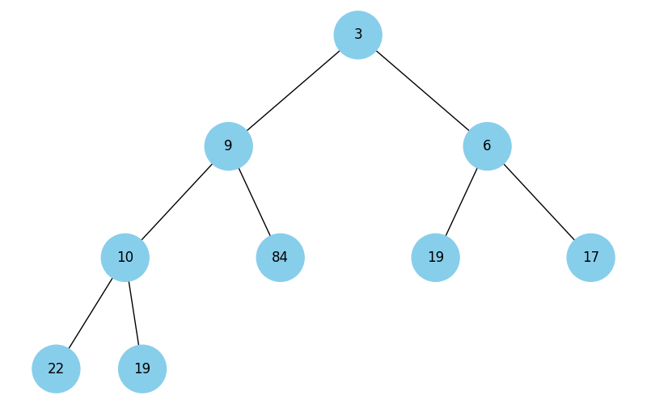
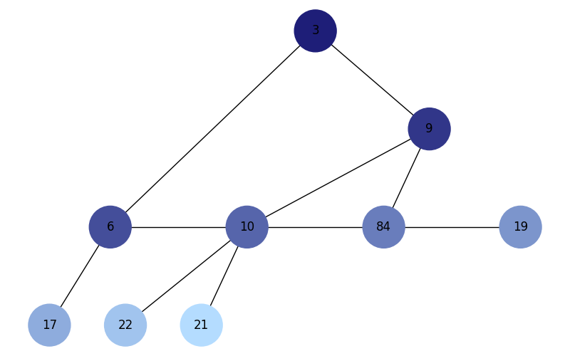
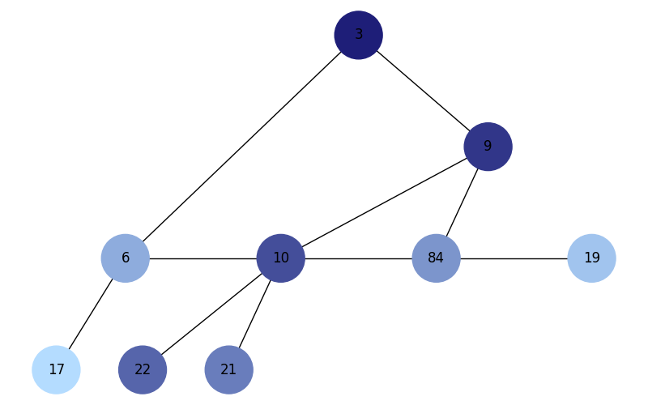
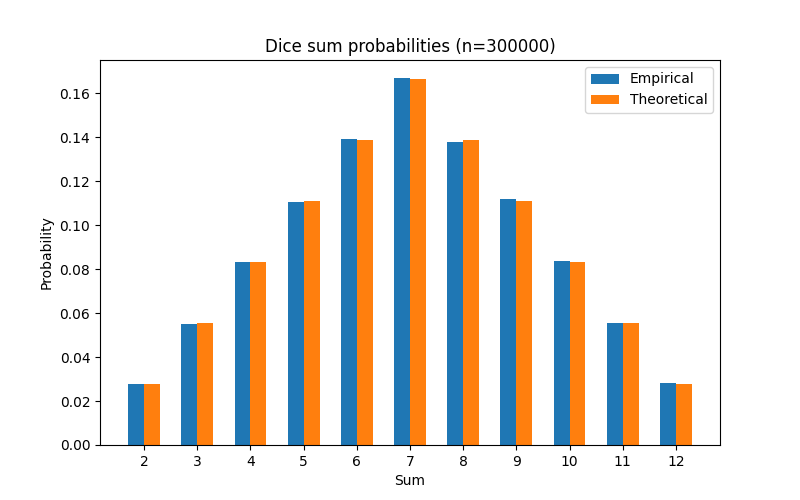

# GOIT Data Structures Final project

```bash
pip install -r requirements.txt
```

## Tasks
- `task-01.py`: singly linked list reverse, insertion sort, merge two sorted lists.
```bash
python task-01.py
```

Initial: [7, 3, 9, 1, 5]
Reversed: [5, 1, 9, 3, 7]
Sorted (insertion): [1, 3, 5, 7, 9]
Merged sorted lists: [1, 2, 3, 4, 5, 6, 7, 8, 10]
Conclusion: reverse changes links in-place; insertion_sort orders the list; merge_sorted combines two sorted lists preserving order.

- `task-02.py`: Pythagoras tree fractal using recursion with `--depth` argument.
```bash
python task-02.py --depth 9
```


- `task-03.py`: Dijkstra's shortest paths with a binary heap.
```bash
python task-03.py
```

Distances: {'A': 0, 'B': 4, 'C': 2, 'D': 9, 'E': 5, 'F': 20}
Parents: {'B': 'A', 'C': 'A', 'E': 'C', 'D': 'E', 'F': 'D'}
Conclusion: using a binary heap keeps selection of the next closest vertex efficient (O((V+E) log V)).
- `task-04.py`: visualize a binary heap as a tree using NetworkX.
```bash
python task-04.py
```

Heap array: [3, 9, 6, 10, 84, 19, 17, 22, 19]
Conclusion: a heap stored in an array maps to a complete binary tree where children of i are 2i+1 and 2i+2.
- `task-05.py`: visualize BFS and DFS of a binary tree with dark→light hex colors, no recursion.
```bash
python task-05.py
```

BFS order: [3, 9, 6, 10, 84, 19, 17, 22, 21]

DFS order: [3, 9, 10, 22, 21, 84, 6, 19, 17]
- `task-06.py`: greedy vs dynamic programming for maximizing calories under a budget.
```bash
python task-06.py
```
Budget: 100
Greedy: ['cola', 'potato', 'pepsi', 'hot-dog'] cost= 80 calories= 870
Dynamic: ['pizza', 'pepsi', 'cola', 'potato'] cost= 100 calories= 970
Conclusion: dynamic programming achieves equal or higher calories for this budget; greedy is faster but may miss optimal combinations.

- `task-07.py`: Monte Carlo dice simulation vs theoretical probabilities.
```bash
python task-07.py
```
Empirical probabilities:
2: 2.76%
3: 5.62%
4: 8.33%
5: 11.12%
6: 13.84%
7: 16.72%
8: 13.86%
9: 11.14%
10: 8.35%
11: 5.49%
12: 2.77%
Conclusion: empirical probabilities approach theoretical values as n grows; 7 is the most likely sum (~16.67%).

